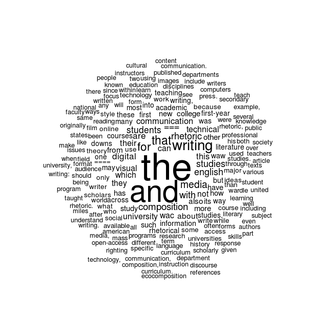

#The Rhetoric of Data Janitorial Work

##Introduction
Rhetoric and statistics have a lot in common. Both frameworks provide wide-ranging methods of analysis and knowledge-construction that may be applied to an endless array of topics and content areas for research. Because of this commonality, the two are active in many (if not all) disciplines in the academy. Rhetoric is often associated with qualitative research, and statistics with quantitative research, but they frequently cross over these boundaries. For example, the questions in a survey may be rhetorically constructed to carefully recuce (or account for) participant bias, but the results of that same survey may be analyzed with statistical tools--counting responses, calculating correlations, and graphing results. Or, as a counter example, statistical tools may be used to test a hypothesis against a particular dataset, and then rhetoric is utilized when researchers interpret and communicate their results. While these two examples draw a distinct (and artificial/traditional) line between rhetoric and statistics, in the areas of data visualization and information design, no such distinction exists. 

As visual rhetoric and design studies turn their attention to data visualization and infographic media, much work remains to understand quantitative reasoning and statistical analysis as rhetorical constructions. In "Rhetorical Numbers: A Case for Quantitative Writing in the Composition Classroom," Joanna Wolfe contends that rhetorical approaches to quantitative reasoning remain largely overlooked in writing studies classrooms. As Wolfe argues, "Rather than reject quantitative argument out of hand, contemporary rhetoricians need to train their students to recognize the unethical, deceptive, and misleading as well as thoughtful, instightful, and revealing applications of quantitative rhetoric" (454). This article provides examples for how the *choices* made during statistical analysis effect the final visualization those analyses produce. The use of the term *choice* here suggests more variablility and indeterminacy than what is often implied by the concept of quantitative reasoning. Wolfe explains, however, that 

XXXTurn to discuss the rhetoric of science and Fhaenstock's quote about feedback between science and rhetoric. 

List of Wikipedia Articles for Corpus:

- Composition studies
- English studies
- Digital rhetoric
- Computers and writing
- Technical communication
- Writing across the curriculum
- Writing about writing
- Visual rhetoric
- Media studies
- Ecocomposition

