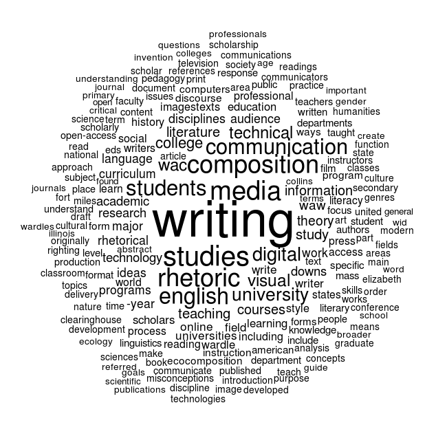

#The Rhetoric of Data Janitorial Work

List of Wikipedia Articles for Corpus:

- composition studies
- English studies
- Digital rhetoric
- computers and writing
- technical communication
- writing across the curriculum
- writing about writing
- visual rhetoric
- media studies
- ecocomposition

<!--In "Rhetorical Numbers: A Case for Quantitative Writing in the Composition Classroom," Joanna Wolfe contends that rhetorical approaches to quantitative information and reasoning remain largely overlooked in writing studies classrooms. As Wolfe argues, "Rather than reject quantitative argument out of hand, contemporary rhetoricians need to train their students to recognize the unethical, deceptive, and misleading as well as thoughtful, instightful, and revealing applications of quantitative rhetoric" (454). While visual rhetoric and design studies have turned their attention to data visualization and infographic rhetorics, much work remains to understand how the canon of invention may be applied to data scrubbing, statistical analysis, and quantitative reasoning. -->

<!--In some ways, this creates an analogue between process theories of composition and the development of quantitative arguments that lead to data visualizations. Sidney Dobrin and xxx in *Abducting Writing Studies* argues that the recent "writing about writing" trend in writing studies research allows the field to "recupperate" useful elements of "process" rhetorics without returning to long-exhausted debates. -->

<!--I'm working a webtext that deals with visual rhetoric and information design. It is tentatively titled: "The Rhetoric of Data Janitorial Work," and explains how the process of scrubbing data (removing unnecessary components of data, or reorganizing data for specific rhetorical purposes) for analysis and visualization can have widely varied rhetorical effects on what the final infographics may "say" or "communicate." -->

<!--I create word cloud visualizations from scratch using text data--writing and sharing all of the underlying code--and I explain how the various steps in the process effect the final visual arguments that appear in the data visualizations (word clouds). As visual rhetoric continues to confront issues related to information design and infographic rhetorics, understanding how data janitorial choices limit or expand the possibilities for visual design are a crucial part of this ongoing conversation. -->
